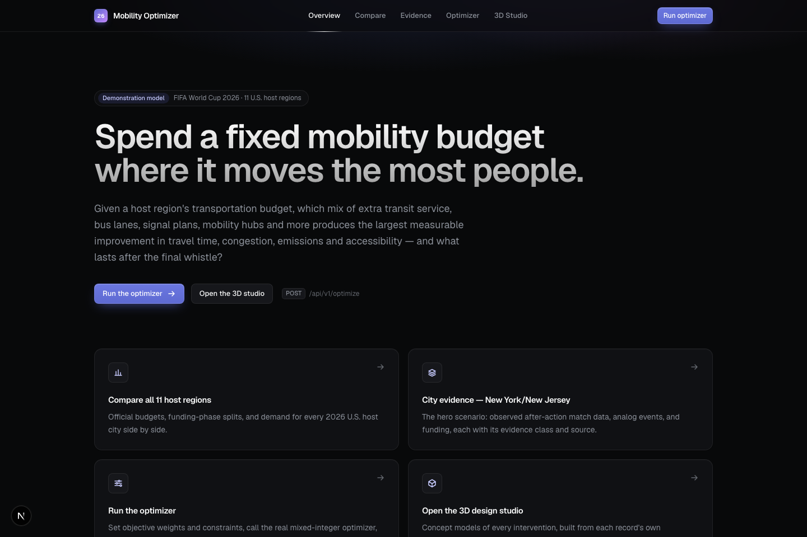
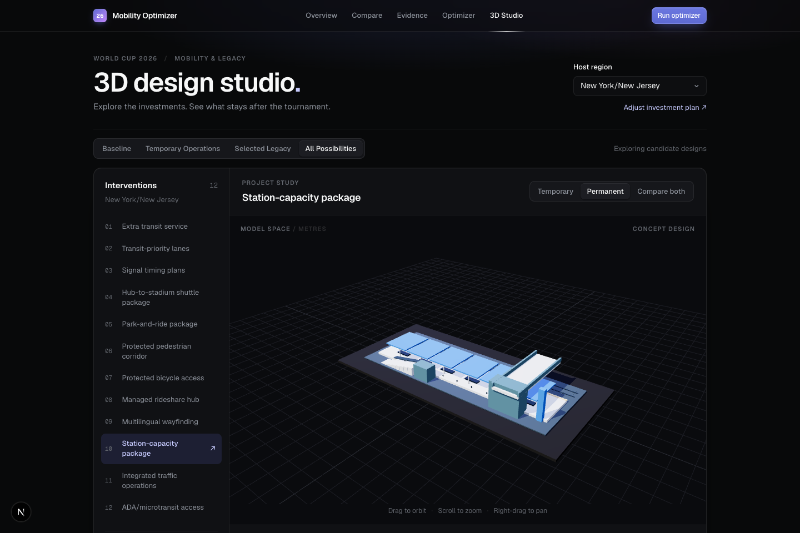
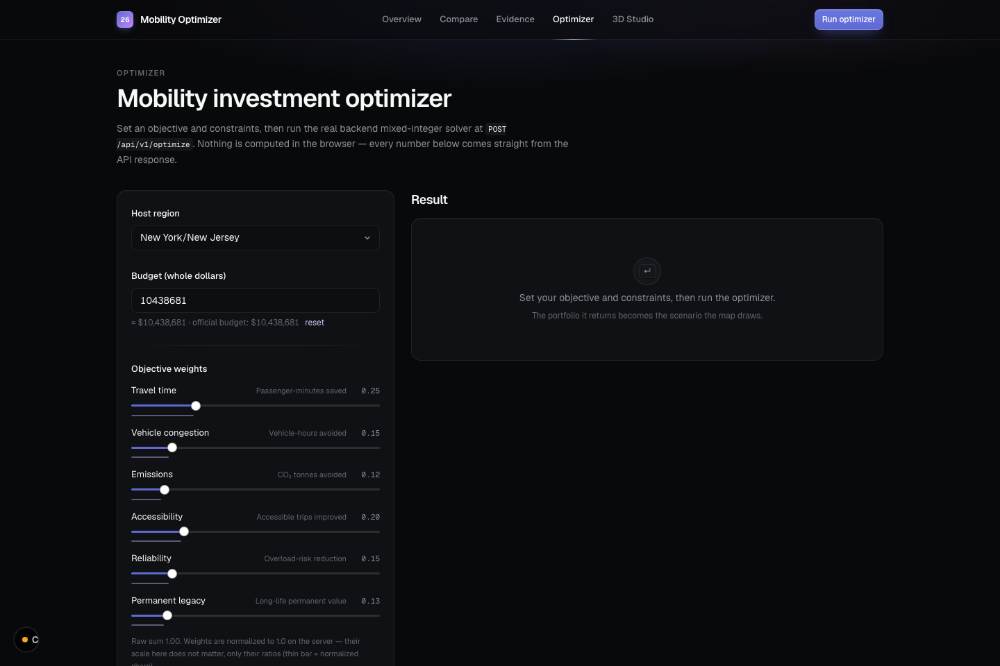
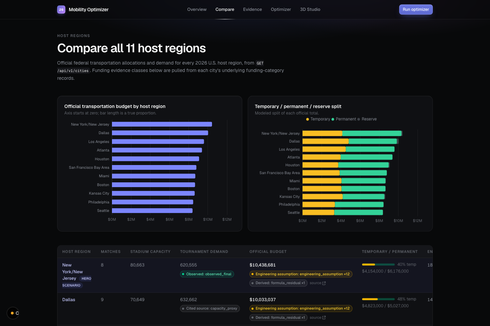
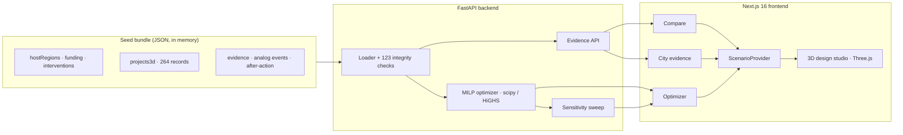

<div align="center">

# CityStride

### World Cup 2026 Host-City Mobility Investment & Legacy Optimizer

**Spend a fixed mobility budget where it moves the most people — and see what lasts after the final whistle.**

[](https://adityaabandaru.github.io/hackathons/)
[](backend/)
[](frontend/)
[](#verification)



</div>

---

## The question

Eleven U.S. host regions are about to spend roughly **$100 million** of transportation funding on the FIFA World Cup 2026. Every dollar can go to one of twelve interventions — extra transit service, bus lanes, signal plans, mobility hubs, station capacity, park-and-ride, wayfinding and more — and every intervention can be **temporary** (gone after the tournament) or **permanent** (a legacy for the city).

**CityStride** answers, for each host region:

> Given this budget, which portfolio of interventions produces the largest measurable improvement in travel time, congestion, emissions, accessibility and reliability — and how much of it is still there in 2027?

It does that with a **real mixed-integer optimizer** over evidence-anchored data, and it shows the result as **solid 3D concept models** of the infrastructure each city would actually build.

## What you can do

| | |
|---|---|
| **Compare** all 11 host regions | Official budgets, temporary / permanent / reserve splits, stadium demand — every number tagged with its evidence class and source. |
| **Read the evidence** for a city | Match-day after-action data (NJ Transit at MetLife), analog events, pedestrian design volumes, 2026 forecasts. Nothing is presented as fact unless it is one. |
| **Run the optimizer** | Set six objective weights and hard constraints (accessibility share, temporary cap, permanent floor, construction limit, required / excluded interventions). The backend solves a MILP with HiGHS and returns project IDs, spend, phase split, modeled benefits and the next-best marginal dollar. Infeasible? You get diagnostics, not a guess. |
| **Stress-test it** | A sensitivity sweep re-solves across attendance, budget, cost, transit capacity and visitor transit usage, and tells you whether the portfolio is stable. |
| **See it in 3D** | The design studio builds a concept model of every one of the 264 project records from its own recorded dimensions, city-specific (a rail-walkway station at the Meadowlands, a K-Line interchange at Inglewood, a bus-dispatch hub at Arrowhead). Compare temporary and permanent at the same scale, orbit, and export GLB. |

<div align="center">

<br><sub>The 3D design studio: the permanent station-capacity concept for the Meadowlands, built from the record's own 120 × 45 × 18 m envelope.</sub>
</div>

<br>

<div align="center">
&nbsp;

</div>

## Why it's trustworthy

These rules are enforced in code and tests, not just promised:

- **Money is integer cents.** The 11 official allocations reconcile to exactly `10,025,021,200` cents — asserted at startup and in tests.
- **Every record keeps its evidence.** `evidenceClass`, `qualifier`, methodology note and `sourceUrl` travel with every value to the screen. Model outputs and engineering assumptions are labelled as such, everywhere.
- **Missing values stay missing.** Nothing is silently coerced to zero.
- **The optimizer is the only thing that "selects".** The frontend renders exactly the project IDs the API returned; it never invents a portfolio. Baseline mode is empty by construction.
- **3D models are honest.** Each model's envelope is the record's own length × width × height (a test builds all 264 and checks). Architectural detail is illustrative, positions are planning anchors at ±25–100 m, and the page says so next to the scene.
- **No paid APIs, no keys, no accounts.** Seed data is loaded in memory from JSON; nothing phones home.

## Architecture



- **Backend** — Python 3.11, FastAPI, Pydantic, `scipy.optimize.milp` (HiGHS). Segment-based diminishing returns, synergy pairs, a six-dimension objective including permanent legacy, homogeneous linear constraints, preflight infeasibility diagnostics.
- **Frontend** — Next.js 16 (App Router), React 19, TypeScript, Tailwind 4, TanStack Query, ECharts, Three.js. Dark, Linear-inspired design system.

## Run it locally

Requires **Node.js 20.9+** and **Python 3.11+**.

```bash
# backend — http://localhost:8000
cd backend
python3 -m venv .venv && ./.venv/bin/pip install -e ".[dev]"
./.venv/bin/uvicorn app.main:app --port 8000
```

```bash
# frontend — http://localhost:3000
cd frontend
npm ci
npm run dev
```

Then open http://localhost:3000. Run the optimizer once to unlock the scenario-dependent studio modes.

## Deploy

**Frontend** builds to a static site for GitHub Pages (`NEXT_OUTPUT=export`); the workflow in the repository root does this on every push.

**Backend** runs anywhere Python does. A [Render](https://render.com) blueprint is included in the repository root — deploy it, then set the repository variable `API_BASE_URL` to the backend's URL and re-run the Pages workflow. Set `CORS_ALLOWED_ORIGINS` on the backend to the Pages origin.

## Verification

```bash
cd backend  && ./.venv/bin/python -m pytest      # 142 passed
cd frontend && npm run lint && npm test && npm run build   # 52 passed, clean
```

Highlights of what the tests prove: allocation reconciliation to the cent; the Match 104 after-action record; the four required optimizer assertions; 422 diagnostics on infeasible scenarios; all 264 3D models inside their envelopes with provenance intact; Baseline empty in every city; a scenario for one city selecting nothing in another.

## Repository layout

```
backend/    FastAPI app, optimizer, seed loader, 142 tests
frontend/   Next.js app, 3D studio, 52 tests
reference/  Authoritative task spec, seed JSON, pre-generated GeoJSON (never edited)
models/     Exported GLB station concepts
docs/       Per-phase build notes and modelling assumptions
pitch/      Pitch deck, demo script, submission checklist
```

## Modelling assumptions, in one place

Every figure on this site is either linked, sourced evidence, or a labelled engineering assumption / model output. Benefit coefficients are engineering assumptions, not calibrated forecasts; attendance scales benefits uniformly; 3D detail inside a recorded envelope is illustrative; no terrain, surrounding buildings or the stadium are modelled. Full list in [`docs/phase-5-map.md`](docs/phase-5-map.md) and [`docs/phase-3-optimizer.md`](docs/phase-3-optimizer.md). Nothing here is an official city, state or federal commitment.

---

<div align="center"><sub>Built for a 2026 hackathon by Adityaa Bandaru. Demonstration model.</sub></div>
